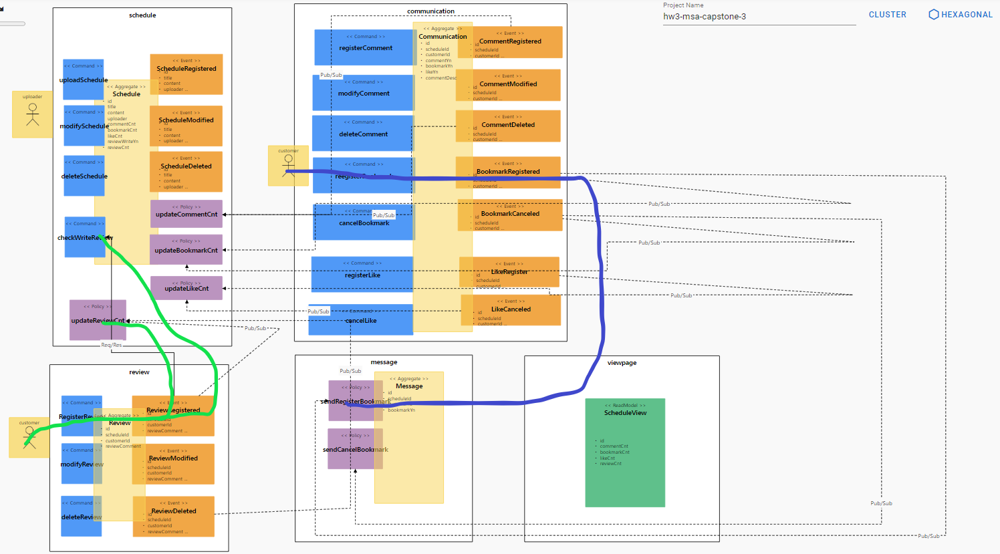

# 분석설계

#### 기능적 요구사항
- 호스트가 데이트 코스를 등록/수정/삭제한다.
- 고객이 데이트 코스에 대한 내용을 확인할 수 있다.
- 고객이 데이트 코스를 선택하여 북마크한다
- 고객이 마음에 드는 데이트 코스를 선택하여 좋아요(like)를 누른다.
- 고객이 좋아요(like)를 취소할 수 있다.
- 북마크가 되면 북마크한 내역(Message)이 전달된다.
- 고객이 북마크를 취소할 수 있다.
- 북마크가 취소될 경우 취소 내역(Message)이 전달된다.
- 고객이 데이트 코스에 대한 후기(review)를 남길 수 있다.
- 전체적인 데이트 코스에 대한 정보 및 후기 상태 등을 한 화면에서 확인 할 수 있다.(viewpage)

#### 비기능적 요구사항
- 마이크로 서비스를 넘나드는 시나리오에 대한 트랜잭션 처리
- 리뷰 작성 시 리뷰 작성이 가능한지 확인한다
- 고객이 코스(schedule) 상태를 시스템에서 확인할 수 있어야 한다 (CQRS)


### Event storming 결과

</img><br/>


### 기능적, 비기능적 요구사항 검토

</img><br/>


### 헥사고날 아키텍쳐 도출

</img><br/>


# SAGA Pattern

## 구현

서비스를 아래와 같은 방법으로 개별적으로 실행한다.

```java
$ cd schedule
$ mvn spring-boot:run
```

```java
$ cd communication
$ mvn spring-boot:run
```

```java
$ cd review
$ mvn spring-boot:run
```

```java
$ cd viewpage
$ mvn spring-boot:run
```

4개의 도메인으로 관리되고 있으며 코스관리(Schedule), 소통(Communication), 후기(Review), 코스조회(Viewpage)으로 구성된다.

# CQRS Pattern


### CQRS 패턴?

- CRUD에서 CUD(Command)와 R(Query)의 책임을 분리한 것이 CQRS 입니다.

## 구현

스케쥴(Schedule)의 리뷰 및 북마크 갯수 등 총 Status 에 대하여 고객(Customer)이 조회 할 수 있도록 CQRS 로 구현하였다.

- schedule, review, communication, message 개별 Aggregate Status 를 통합 조회하여 성능 Issue 를 사전에 예방할 수 있다.

- 비동기식으로 처리되어 발행된 이벤트 기반 Kafka 를 통해 수신/처리 되어 별도 Table 에 관리한다

Table 모델링 (ROOMVIEW)


# Correlation / Compensation(Unique Key)

## Correlation

SNS Project에서는 PolicyHandler에서 처리 시 어떤 건에 대한 처리인지를 구별하기 위한 Correlation-key 구현을 이벤트 클래스 안의 변수로 전달받아 서비스간 연관된 처리를 정확하게 구현하고 있습니다.


# Request / Response (Feign Client / Sync.Async)

```java
        // 해당 리뷰가 등록가능한 상태인지 체크
        hwmsacapstone.external.Schedule schedule = new hwmsacapstone.external.Schedule();
        boolean result = ReviewApplication.applicationContext
            .getBean(hwmsacapstone.external.ScheduleService.class)
            .checkWriteReview(schedule);
        if (result){
            // 예약 가능한 상태인 경우(Available)
            // 등록
            ReviewRegistered reviewRegistered = new ReviewRegistered(this);
            reviewRegistered.publishAfterCommit();
        }
```

### Feign Client 란?

1) Feign Client는 ***\*web service 클라이언트를 보다 쉽게 작성할 수 있도록 도와줍니다.\****
2) interface를 작성하고 annotation을 붙여주면 세부적인 내용 없이 사용할 수 있기 때문에 ***\*코드 복잡도가 낮아집니다.\****
3) ***\*Netflix\**** 에서 만들어졌고, ***\*spring-cloud-starter-openfeign\**** 으로 스프링 라이브러리에서 사용할 수 있습니다.


# Gateway

**1) gateway 서비스 포트 8080으로 지정**
```
server:
  port: 8088
```

**2) 설정 파일(application.yaml) 내 각 마이크로 서비스 route 추가**
```
spring:
  profiles: docker
  cloud:
    gateway:
      routes:
        - id: schedule
          uri: http://schedule:8080
          predicates:
            - Path=/schedules/** 
        - id: review
          uri: http://review:8080
          predicates:
            - Path=/reviews/** 
        - id: viewpage
          uri: http://viewpage:8080
          predicates:
            - Path= 
        - id: message
          uri: http://message:8080
          predicates:
            - Path=/messages/** 
        - id: communication
          uri: http://communication:8080
          predicates:
            - Path=/communications/** 
        - id: frontend
          uri: http://frontend:8080
          predicates:
            - Path=/**
      globalcors:
        corsConfigurations:
          '[/**]':
            allowedOrigins:
              - "*"
            allowedMethods:
              - "*"
            allowedHeaders:
              - "*"
            allowCredentials: true
```

**3) Kubernetes Deployment.yaml 작성**
```
apiVersion: apps/v1
kind: Deployment
metadata:
  name: gateway
  labels:
    app: gateway
spec:
  replicas: 1
  selector:
    matchLabels:
      app: gateway
  template:
    metadata:
      labels:
        app: gateway
    spec:
      containers:
        - name: gateway
          image: username/gateway:latest
          ports:
            - containerPort: 8080
```

**4) Deploy**
```
$ kubectl apply -f deployment.yaml
```

**5) Kubernetes용 Service.yaml 작성**
```
apiVersion: v1
kind: Service
metadata:
  name: gateway
  labels:
    app: gateway
spec:
  ports:
    - port: 8080
      targetPort: 8080
  selector:
    app: gateway
  type: LoadBalancer
```

**6) Service/LoadBalancer 생성하여 Gateway end point 확인**
```
$ kubectl apply -f service.yaml
$ kubectl get svc -n schedule
```


# Deploy / Pipeline

## 패키징

```shell
cd review
cd schedule
cd communication
cd message
mvn package -B -Dmaven.test.skip=true
```

## 도커라이징 이미지 빌드

```shell
docker build -t 004814395703.dkr.ecr.ca-central-1.amazonaws.com/schedule:v1 .
docker push 004814395703.dkr.ecr.ca-central-1.amazonaws.com/schedule:v1
```

## 쿠버네티스 클러스터 생성

```shell
eksctl create cluster --name msa3-user10 --version 1.19 --spot --managed --nodegroup-name standard-workers --node-type t3.medium --nodes 3 --nodes-min 1 --nodes-max 3
```

## 클러스터에 배포

```shell
kubectl create deploy review --image=004814395703.dkr.ecr.ap-northeast-2.amazonaws.com/schedule:v1
kubectl expose deploy review --port=8080
```

각 구현체 파드들은 각자의 source repository 에 구성되었고, 사용한 CI/CD 플랫폼은 AWS의 EKS를 사용하였다.
파드들은 패키지화 하여 도커 이미지 빌드 후에 배포하였고 Dockerfile에 저장되어있는 형태로 도커라이징 하여 쿠버네티스 클러스터에 배포하였다.
pipeline build script 는 각 프로젝트 폴더 이하에 cloudbuild.yml 에 포함되었다.


# Circuit Breaker


# Autoscale(HPA)


# Self-Healing(Liveness Probe)


# Zero-Downtime Deploy(Readiness Probe)


# Config Map / Persistence Volume


# Polyglot
